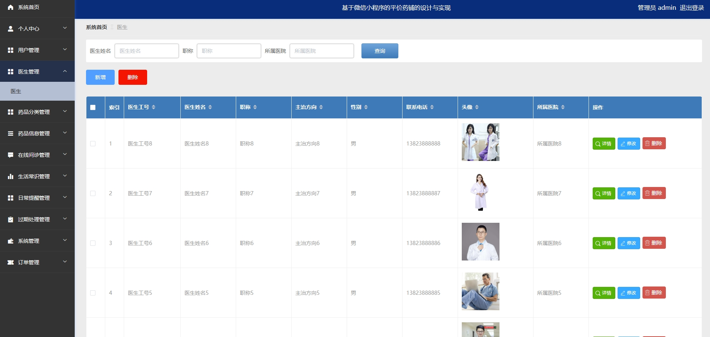

# 1.项目介绍
- 系统角色：管理员、医生、普通用户
- 功能模块：用户管理、医生管理、药品分类管理、药品信息管理、在线问诊管理、生活常识管理、日常提醒管理、过期处理、订单管理等
- 技术选型：SpringBoot，Vue，uniapp等
- 测试环境：idea2024，jdk17（太低会报错），maven3，微信开发工具，HbuilderX，navicat
# 2.项目部署
## 2.1 后端部署
- 创建数据库，并导入db下的sql文件
- 通过idea打开项目，根据本地数据库环境配置src/main/resources/application.yml 12-15行
- 启动项目 src/main/java/com/SpringbootSchemaApplication.java
- 管理web：http://localhost:8080/springboot6odo2/admin/dist/index.html  管理员账号密码：admin/admin， 医生查看yisheng表
- 说明：上述url中的dist是vue项目编译后的，如果你相对前端进行修改，可以通过vscode或者idea安装vue插件，或者webstorm打开src/main/resources/admin/admin 这个是vue项目
## 2.2 小程序部署
- 通过微信开发工具，打开项目mp-weixin
- appid配置为你自己小程序的，或者你自己申请的测试小程序appid
- 信任项目即可，如果页面空白，重新编译下
- 说明：mp-weixin是uniapp项目编译后的，如果你想对小程序做一些修改，你可以通过HbuilderX打开src/main/resources/front/front ，这个是uniapp项目
# 3.项目部分截图

# 4.获取方式
[戳我查看](https://gitee.com/aven999/mall)
